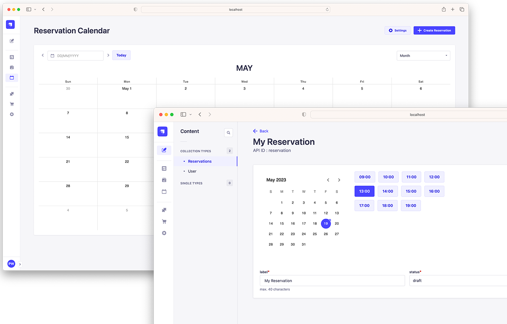

<div align="center">
  
  <h1>Strapi Reservations</h1>

[![forthebadge](data:image/svg+xml;base64,PHN2ZyB4bWxucz0iaHR0cDovL3d3dy53My5vcmcvMjAwMC9zdmciIHdpZHRoPSIxOTMuMjYiIGhlaWdodD0iMzUiIHZpZXdCb3g9IjAgMCAxOTMuMjYgMzUiPjxyZWN0IGNsYXNzPSJzdmdfX3JlY3QiIHg9IjAiIHk9IjAiIHdpZHRoPSIxMDYuMzMiIGhlaWdodD0iMzUiIGZpbGw9IiMyRjJFOEIiLz48cmVjdCBjbGFzcz0ic3ZnX19yZWN0IiB4PSIxMDQuMzMiIHk9IjAiIHdpZHRoPSI4OC45MyIgaGVpZ2h0PSIzNSIgZmlsbD0iIzQ5NDVGRiIvPjxwYXRoIGNsYXNzPSJzdmdfX3RleHQiIGQ9Ik0xNS42OSAyMkwxNC4yMiAyMkwxNC4yMiAxMy40N0wxNi4xNCAxMy40N0wxOC42MCAyMC4wMUwyMS4wNiAxMy40N0wyMi45NyAxMy40N0wyMi45NyAyMkwyMS40OSAyMkwyMS40OSAxOS4xOUwyMS42NCAxNS40M0wxOS4xMiAyMkwxOC4wNiAyMkwxNS41NSAxNS40M0wxNS42OSAxOS4xOUwxNS42OSAyMlpNMjguNDkgMjJMMjYuOTUgMjJMMzAuMTcgMTMuNDdMMzEuNTAgMTMuNDdMMzQuNzMgMjJMMzMuMTggMjJMMzIuNDkgMjAuMDFMMjkuMTggMjAuMDFMMjguNDkgMjJaTTMwLjgzIDE1LjI4TDI5LjYwIDE4LjgyTDMyLjA3IDE4LjgyTDMwLjgzIDE1LjI4Wk00MS4xNCAyMkwzOC42OSAyMkwzOC42OSAxMy40N0w0MS4yMSAxMy40N1E0Mi4zNCAxMy40NyA0My4yMSAxMy45N1E0NC4wOSAxNC40OCA0NC41NyAxNS40MFE0NS4wNSAxNi4zMyA0NS4wNSAxNy41Mkw0NS4wNSAxNy41Mkw0NS4wNSAxNy45NVE0NS4wNSAxOS4xNiA0NC41NyAyMC4wOFE0NC4wOCAyMS4wMCA0My4xOSAyMS41MFE0Mi4zMCAyMiA0MS4xNCAyMkw0MS4xNCAyMlpNNDAuMTcgMTQuNjZMNDAuMTcgMjAuODJMNDEuMTQgMjAuODJRNDIuMzAgMjAuODIgNDIuOTMgMjAuMDlRNDMuNTUgMTkuMzYgNDMuNTYgMTcuOTlMNDMuNTYgMTcuOTlMNDMuNTYgMTcuNTJRNDMuNTYgMTYuMTMgNDIuOTYgMTUuNDBRNDIuMzUgMTQuNjYgNDEuMjEgMTQuNjZMNDEuMjEgMTQuNjZMNDAuMTcgMTQuNjZaTTU1LjA5IDIyTDQ5LjUxIDIyTDQ5LjUxIDEzLjQ3TDU1LjA1IDEzLjQ3TDU1LjA1IDE0LjY2TDUxLjAwIDE0LjY2TDUxLjAwIDE3LjAyTDU0LjUwIDE3LjAyTDU0LjUwIDE4LjE5TDUxLjAwIDE4LjE5TDUxLjAwIDIwLjgyTDU1LjA5IDIwLjgyTDU1LjA5IDIyWk02Ni43NSAyMkw2NS4yNiAyMkw2NS4yNiAxMy40N0w3MC42OCAxMy40N0w3MC42OCAxNC42Nkw2Ni43NSAxNC42Nkw2Ni43NSAxNy4yMEw3MC4xOCAxNy4yMEw3MC4xOCAxOC4zOEw2Ni43NSAxOC4zOEw2Ni43NSAyMlpNNzQuNTcgMTguMDBMNzQuNTcgMTguMDBMNzQuNTcgMTcuNTJRNzQuNTcgMTYuMjggNzUuMDIgMTUuMzJRNzUuNDYgMTQuMzcgNzYuMjcgMTMuODZRNzcuMDcgMTMuMzUgNzguMTEgMTMuMzVRNzkuMTYgMTMuMzUgNzkuOTYgMTMuODVRODAuNzcgMTQuMzUgODEuMjEgMTUuMjlRODEuNjUgMTYuMjMgODEuNjUgMTcuNDhMODEuNjUgMTcuNDhMODEuNjUgMTcuOTZRODEuNjUgMTkuMjEgODEuMjIgMjAuMTZRODAuNzkgMjEuMTAgNzkuOTggMjEuNjFRNzkuMTcgMjIuMTIgNzguMTMgMjIuMTJMNzguMTMgMjIuMTJRNzcuMDkgMjIuMTIgNzYuMjggMjEuNjFRNzUuNDcgMjEuMTAgNzUuMDIgMjAuMTdRNzQuNTggMTkuMjMgNzQuNTcgMTguMDBaTTc2LjA2IDE3LjQ2TDc2LjA2IDE3Ljk2UTc2LjA2IDE5LjM2IDc2LjYwIDIwLjEzUTc3LjE1IDIwLjkwIDc4LjEzIDIwLjkwTDc4LjEzIDIwLjkwUTc5LjExIDIwLjkwIDc5LjY0IDIwLjE1UTgwLjE3IDE5LjQwIDgwLjE3IDE3Ljk2TDgwLjE3IDE3Ljk2TDgwLjE3IDE3LjUxUTgwLjE3IDE2LjA5IDc5LjYzIDE1LjM0UTc5LjEwIDE0LjU4IDc4LjExIDE0LjU4TDc4LjExIDE0LjU4UTc3LjE1IDE0LjU4IDc2LjYxIDE1LjMzUTc2LjA3IDE2LjA5IDc2LjA2IDE3LjQ2TDc2LjA2IDE3LjQ2Wk04Ny42MCAyMkw4Ni4xMiAyMkw4Ni4xMiAxMy40N0w4OS4xMiAxMy40N1E5MC41OSAxMy40NyA5MS40MCAxNC4xM1E5Mi4yMCAxNC43OSA5Mi4yMCAxNi4wNUw5Mi4yMCAxNi4wNVE5Mi4yMCAxNi45MCA5MS43OSAxNy40OFE5MS4zNyAxOC4wNiA5MC42NCAxOC4zN0w5MC42NCAxOC4zN0w5Mi41NSAyMS45Mkw5Mi41NSAyMkw5MC45NiAyMkw4OS4yNSAxOC43MUw4Ny42MCAxOC43MUw4Ny42MCAyMlpNODcuNjAgMTQuNjZMODcuNjAgMTcuNTJMODkuMTIgMTcuNTJRODkuODcgMTcuNTIgOTAuMzAgMTcuMTVROTAuNzIgMTYuNzcgOTAuNzIgMTYuMTFMOTAuNzIgMTYuMTFROTAuNzIgMTUuNDMgOTAuMzMgMTUuMDVRODkuOTQgMTQuNjggODkuMTYgMTQuNjZMODkuMTYgMTQuNjZMODcuNjAgMTQuNjZaIiBmaWxsPSIjRkZGRkZGIi8+PHBhdGggY2xhc3M9InN2Z19fdGV4dCIgZD0iTTExNy45MyAyMS4yNEwxMTcuOTMgMjEuMjRMMTE4LjcxIDE5LjQ5UTExOS4yNyAxOS44NiAxMjAuMDIgMjAuMDlRMTIwLjc2IDIwLjMyIDEyMS40OCAyMC4zMkwxMjEuNDggMjAuMzJRMTIyLjg1IDIwLjMyIDEyMi44NSAxOS42NEwxMjIuODUgMTkuNjRRMTIyLjg1IDE5LjI4IDEyMi40NiAxOS4xMVExMjIuMDcgMTguOTMgMTIxLjIxIDE4Ljc0TDEyMS4yMSAxOC43NFExMjAuMjYgMTguNTMgMTE5LjYyIDE4LjMwUTExOC45OSAxOC4wNiAxMTguNTMgMTcuNTVRMTE4LjA4IDE3LjAzIDExOC4wOCAxNi4xNkwxMTguMDggMTYuMTZRMTE4LjA4IDE1LjM5IDExOC41MCAxNC43N1ExMTguOTIgMTQuMTUgMTE5Ljc1IDEzLjc5UTEyMC41OSAxMy40MyAxMjEuNzkgMTMuNDNMMTIxLjc5IDEzLjQzUTEyMi42MiAxMy40MyAxMjMuNDMgMTMuNjJRMTI0LjIzIDEzLjgwIDEyNC44NSAxNC4xN0wxMjQuODUgMTQuMTdMMTI0LjExIDE1LjkzUTEyMi45MSAxNS4yOCAxMjEuNzggMTUuMjhMMTIxLjc4IDE1LjI4UTEyMS4wNyAxNS4yOCAxMjAuNzUgMTUuNDlRMTIwLjQzIDE1LjcwIDEyMC40MyAxNi4wNEwxMjAuNDMgMTYuMDRRMTIwLjQzIDE2LjM3IDEyMC44MSAxNi41NFExMjEuMjAgMTYuNzEgMTIyLjA1IDE2Ljg5TDEyMi4wNSAxNi44OVExMjMuMDEgMTcuMTAgMTIzLjY0IDE3LjMzUTEyNC4yNyAxNy41NiAxMjQuNzMgMTguMDdRMTI1LjE5IDE4LjU4IDEyNS4xOSAxOS40NkwxMjUuMTkgMTkuNDZRMTI1LjE5IDIwLjIxIDEyNC43NyAyMC44M1ExMjQuMzUgMjEuNDQgMTIzLjUxIDIxLjgwUTEyMi42NyAyMi4xNyAxMjEuNDcgMjIuMTdMMTIxLjQ3IDIyLjE3UTEyMC40NSAyMi4xNyAxMTkuNDkgMjEuOTJRMTE4LjUzIDIxLjY3IDExNy45MyAyMS4yNFpNMTMxLjU2IDE1LjQ4TDEyOC45OCAxNS40OEwxMjguOTggMTMuNjBMMTM2LjUwIDEzLjYwTDEzNi41MCAxNS40OEwxMzMuOTMgMTUuNDhMMTMzLjkzIDIyTDEzMS41NiAyMkwxMzEuNTYgMTUuNDhaTTE0My4yNSAyMkwxNDAuODcgMjJMMTQwLjg3IDEzLjYwTDE0NC43MiAxMy42MFExNDUuODYgMTMuNjAgMTQ2LjcwIDEzLjk4UTE0Ny41MyAxNC4zNSAxNDcuOTkgMTUuMDZRMTQ4LjQ1IDE1Ljc2IDE0OC40NSAxNi43MUwxNDguNDUgMTYuNzFRMTQ4LjQ1IDE3LjYyIDE0OC4wMiAxOC4zMFExNDcuNTkgMTguOTggMTQ2LjgwIDE5LjM2TDE0Ni44MCAxOS4zNkwxNDguNjEgMjJMMTQ2LjA3IDIyTDE0NC41NSAxOS43N0wxNDMuMjUgMTkuNzdMMTQzLjI1IDIyWk0xNDMuMjUgMTUuNDdMMTQzLjI1IDE3LjkzTDE0NC41NyAxNy45M1ExNDUuMzAgMTcuOTMgMTQ1LjY3IDE3LjYxUTE0Ni4wNSAxNy4yOSAxNDYuMDUgMTYuNzFMMTQ2LjA1IDE2LjcxUTE0Ni4wNSAxNi4xMiAxNDUuNjcgMTUuNzlRMTQ1LjMwIDE1LjQ3IDE0NC41NyAxNS40N0wxNDQuNTcgMTUuNDdMMTQzLjI1IDE1LjQ3Wk0xNTQuNjUgMjJMMTUyLjIzIDIyTDE1NS45NCAxMy42MEwxNTguMjggMTMuNjBMMTYxLjk5IDIyTDE1OS41MyAyMkwxNTguODcgMjAuMzdMMTU1LjMxIDIwLjM3TDE1NC42NSAyMlpNMTU3LjA5IDE1LjkzTDE1Ni4wMSAxOC42MUwxNTguMTcgMTguNjFMMTU3LjA5IDE1LjkzWk0xNjguNTMgMjJMMTY2LjE1IDIyTDE2Ni4xNSAxMy42MEwxNjkuOTkgMTMuNjBRMTcxLjEzIDEzLjYwIDE3MS45NyAxMy45OFExNzIuODEgMTQuMzUgMTczLjI3IDE1LjA2UTE3My43MiAxNS43NiAxNzMuNzIgMTYuNzFMMTczLjcyIDE2LjcxUTE3My43MiAxNy42NiAxNzMuMjcgMTguMzVRMTcyLjgxIDE5LjA1IDE3MS45NyAxOS40MlExNzEuMTMgMTkuODAgMTY5Ljk5IDE5LjgwTDE2OS45OSAxOS44MEwxNjguNTMgMTkuODBMMTY4LjUzIDIyWk0xNjguNTMgMTUuNDdMMTY4LjUzIDE3LjkzTDE2OS44NSAxNy45M1ExNzAuNTggMTcuOTMgMTcwLjk1IDE3LjYxUTE3MS4zMiAxNy4yOSAxNzEuMzIgMTYuNzFMMTcxLjMyIDE2LjcxUTE3MS4zMiAxNi4xMiAxNzAuOTUgMTUuODBRMTcwLjU4IDE1LjQ3IDE2OS44NSAxNS40N0wxNjkuODUgMTUuNDdMMTY4LjUzIDE1LjQ3Wk0xODAuODYgMjJMMTc4LjQ4IDIyTDE3OC40OCAxMy42MEwxODAuODYgMTMuNjBMMTgwLjg2IDIyWiIgZmlsbD0iI0ZGRkZGRiIgeD0iMTE3LjMzIi8+PC9zdmc+)](https://strapi.io/)

Strapi plugin for making reservations based on predefined time slots.

  
</div>

## Get Started

- [Features](#features)
- [Installation](#installation)

## <a id="features"></a> Features

- Create reservation based on predefined time slots
- Time slots are generated based on defined schedule (opening hours) and can be created automaticly or manualy
- Schedules can be defined for exact period of time or for certain time of the year, without considering the year (yearless)
- Supports holidays ([date-holidays](https://www.npmjs.com/package/date-holidays))
- View reservations in calendar (day, week or month view)
- API for getting time slots
- Confirm or cancel reservation (supports callback functions)
- Supports i18n for content and user's preferred language for UI

## <a id="installation"></a> Installation

To install this plugin, you need to add an NPM dependency to your Strapi application.

```sh
# Using Yarn
yarn add @weingerl/strapi-reservations

# Or using NPM
npm install @weingerl/strapi-reservations
```

Update your `./config/plugins.js` file if it already exists or create it with the following:

```js
module.exports = ({ env }) => ({
  // ...
  "strapi-reservations": {
    enabled: true,
  },
  // ...
});
```

Then, you'll need to build your admin panel:

```sh
# Using Yarn
yarn build

# Or using NPM
npm run build
```

## Todo list:

- [ ] double click on calendar cell to create registration
- [ ] differentiate/disable cells on calendar that doesn't have available time slots
