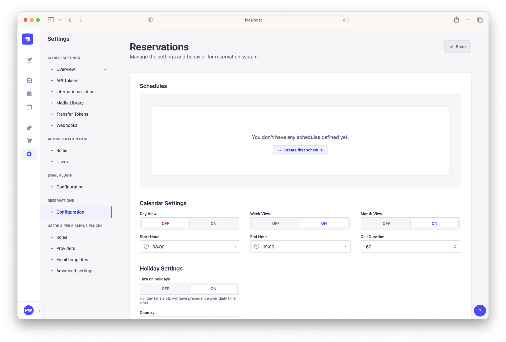
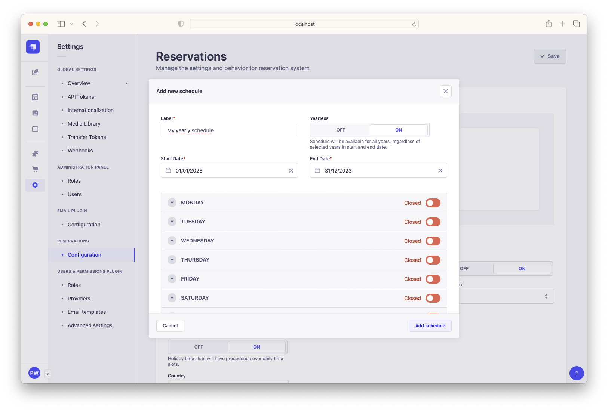
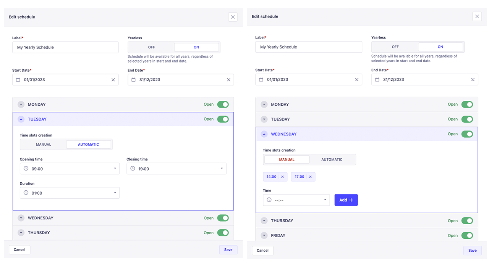
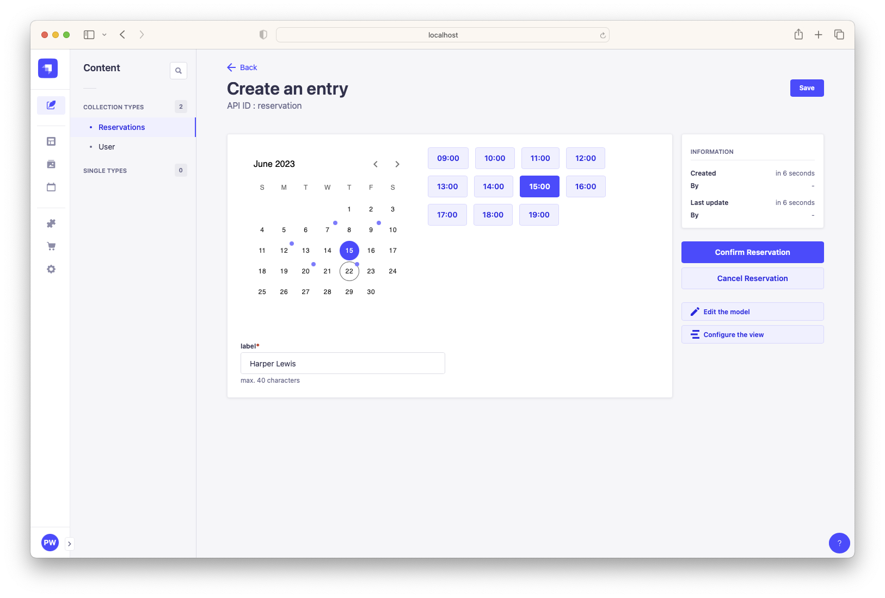
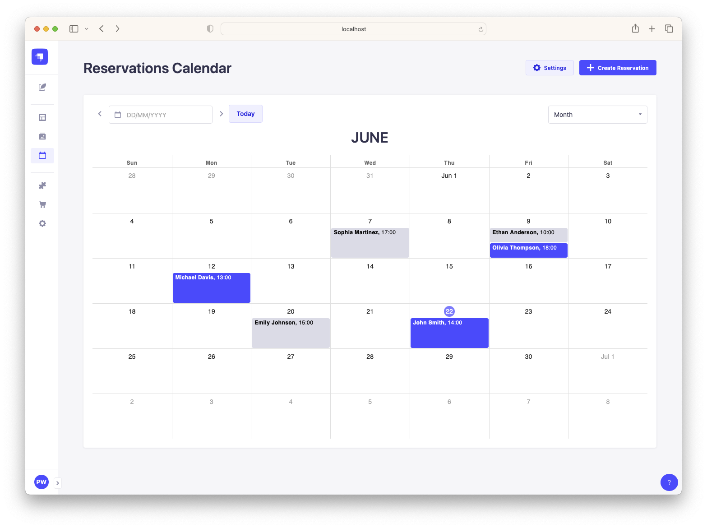
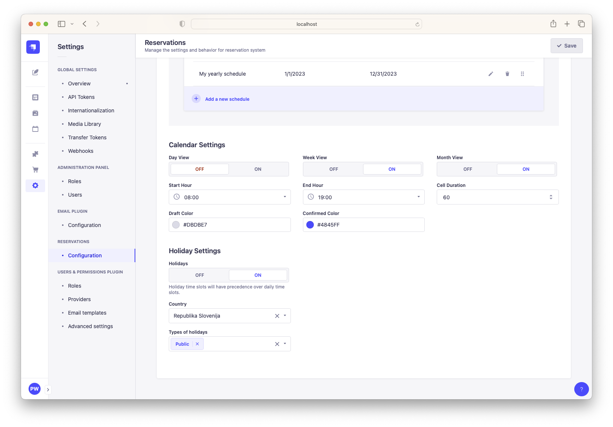

<div align="center">
  
  <h1>Strapi Reservation Plugin</h1>

<a href="https://strapi.io/" target="_blank"></a>

The Strapi Reservation Plugin is a custom plugin designed to enable reservation
functionality with predefined time slots.

  
</div>

## Get Started

- [Features](#features)
- [Installation](#installation)
- [Usage](#installation)
  - [Creating a schedule](#creating-schedule)
  - [Creating a Reservation in the Admin Panel](#creating-reservation)
  - [Reservations Calendar](#reservations-calendar)
- [API endpoint](#api-endpoint)
- [Callback functions](#callback-functions)
- [Settings](#settings)
- [Todo List](#todo)
- [Support or Donate](#donate)

## <a id="features"></a> Features

- Create reservations based on predefined time slots.
- Choose between manual or automatic time slot creation for different time
  periods (schedules).
- Define different time slots for each day of the week.
- Define different time slots for holidays.
- View reservations in a calendar with day, week, or month view.
- Access the API for retrieving time slots.
- Confirm or cancel reservations, with support for callback functions.
- Supports internationalization (i18n) for content and user's preferred language
  for the UI.

## <a id="installation"></a> Installation

To install this plugin, you need to add an NPM dependency to your Strapi
application.

```sh
# Using Yarn
yarn add @weingerl/strapi-reservations

# Or using NPM
npm install @weingerl/strapi-reservations
```

Update your `./config/plugins.js` file if it already exists or create it with
the following:

```js
module.exports = ({ env }) => ({
  // ...
  "strapi-reservations": {
    enabled: true,
  },
  // ...
});
```

Then, you'll need to build your admin panel:

```sh
# Using Yarn
yarn build

# Or using NPM
npm run build
```

## <a id="usage"></a> Usage

### <a id="creating-schedule"></a> Creating a schedule

The first step is to define a schedule that will serve as the basis for
generating time slots. To do so, navigate to **Settings > Reservations >
Configuration** or click **Settings** button on the
[Reservation Calendar](#reservations-calendar).



Click on the button **Create first schedule** to add you first schedule.



Choose a suitable label name and specify the start and end dates accordingly. If
you want to configure time slots for a specific time period, regardless of the
year, you can enable the "yearless" option. For instance, if you want the same
time slots throughout the entire year, set the start date to 01/01/2023 and the
end date to 31/12/2023. If you leave the "yearless" option turned off, the time
slots will be available only for the year 2023. However, if you enable the
"yearless" option, the time slots will be available for all years.

If you wish to add time slots for a specific day of the week, set its state to
"open". However, if you want to make that day unavailable for time slots, set
its state to "closed". Once you've set it to "open", you can then choose between
two modes for creating time slots:

- **Manual**: define time slots manually without any restrictions
- **Automatic**: define time slots automatically by setting opening time,
  closing time and duration between slots. For example, if you set opening time
  to 09.00, closing time to 19:00, and duration to 02:00 the following time
  slots will be available: 09:00, 11:00, 13:00, 15:00, 17:00, 19:00.



You can create as many schedules as you wish. **If multiple schedules exist for
a particular day, the schedule listed at the top will have precedence.** You can
easily reorder the schedules by using the drag and drop functionality.

### <a id="creating-reservation"></a> Creating a Reservation in the Admin Panel

To create a new reservation in the admin panel, go to **Content Manager >
Reservations** or click **Create Reservation** button on the
[Reservation Calendar](#reservations-calendar) page. By default, the content
type includes two required fields:

- **date**: represents the date and time of the reservation
- **label**: used for displaying the reservation in the calendar

You can customize the content type by adding additional fields in the
Content-Type Builder.

To select a date, simply click on the calendar, and all available time slots for
the selected date will be displayed. If no slots are available, the date will be
disabled in the calendar. If a time slot has already been booked, it will also
be disabled. Please note that only one reservation can be created for a single
time slot.



The content type includes an additional field called "status," which is hidden
from the admin panel. The initial value of this field is set to "draft".
However, you can change the status by clicking on the **Confirm Reservation**
button located on the right side. This action will update the status to
"confirmed" and trigger the confirmation callback function. This allows for
additional functionality, such as sending an email to the user or creating a
ticket with a third-party API. Similarly, by clicking on the **Cancel
Reservation** button, the status will be reverted back to "draft" and the
cancellation callback function will be invoked. For more information on how to
set callback functions, please refer to the section
[Callback Functions](#callback-functions).

### <a id="reservations-calendar"></a> Reservations Calendar

Navigate to the **Reservations** page in the left sidebar to access an overview
of all reservations presented in a calendar format.



## <a id="api-endpoint"></a> API endpoint

The plugin provides API endpoint to get time slots based on provided date:

`GET /api/strapi-reservations/time-slots/:type/:date`

| Parameter | Description                                                                                       | Value                |
| --------- | ------------------------------------------------------------------------------------------------- | -------------------- |
| `type`    | determine whether you want time slots for a single day,<br /> the whole week, or an entire month. | day \| week \| month |
| `date`    | provided date                                                                                     | MM-DD-YYYY           |

> **Note** Don't forget to grant permissions to your API token in the global
> settings.

### Get slots for a single day

`GET /api/strapi-reservations/time-slots/day/04-22-2023`

The return object has the following properties:

- `date` (string): The provided date.
- `day` (string): The name of the day of the week.
- `reservations` (boolean): Indicates whether any reservations already exist for
  the given day.
- `slots` (false | array): Returns false if no slots are defined, or an array of
  slots. Each slot is presented as an object with the `time` and `available`
  properties.

Here's an example of the return object structure:

```json
{
    "date": "2023-04-22T00:00:00+02:00",
    "day": "Saturday",
    "reservations": false,
    "slots": [
        {
            "time": "09:00",
            "available": true
        },
        {
            "time": "10:00",
            "available": false
        },
        ...
    ]
}
```

### Get slots for a week

`GET /api/strapi-reservations/time-slots/week/04-22-2023`

The returned object provides time slots for all days in a week and has the
following structure:

```json
{
    "1": {
        "date": "2023-04-16T00:00:00+02:00",
        "day": "Sunday",
        "reservations": false,
        "slots": [
            {
                "time": "09:00",
                "available": true
            },
            ...
        ]
    },
    "2": {
        "date": "2023-04-17T00:00:00+02:00",
        "day": "Monday",
        "reservations": true,
        "slots": [
            {
                "time": "09:00",
                "available": true
            },
            ...
        ]
    },
    ...
}
```

Each day in the week is represented by a numeric key ("1" for Sunday, "2" for
Monday, etc.). Within each day, the object has the same structure as explain
before.

### Get slots for a month

`GET /api/strapi-reservations/time-slots/month/04-22-2023`

In the returned object keys representing the days of the month (in the given
example for April 2023 ) and values containing the details for each day:

```json
{
  "1": {
      "date": "2023-04-01T00:00:00+02:00",
      "day": "Saturday",
      "reservations": false,
      "slots": [
          {
              "time": "09:00",
              "available": true
          },
        ...
      ]
    },
    "2": {
        "date": "2023-04-02T00:00:00+02:00",
        "day": "Sunday",
        "reservations": false,
        "slots": false
    },
    ...
}
```

## <a id="callback-functions"></a> Callback Functions

To enhance the functionality when confirming or canceling a reservation (e.g.,
sending an email to the user), modify the `service hooks` functions of the
plugin:

```js
// ./src/extensions/strapi-reservations/strapi-server.js

module.exports = plugin => {
  plugin.services.hooks = () => ({
    async onConfirm(ctx) {
      const { body: data } = ctx.request;
      // do something with reservation data when reservation is confirmed
    },

    async onCancel(ctx) {
      const { body: data } = ctx.request;
      // do something with reservation data when reservation is canceled
    },
  });
  return plugin;
};
```

## <a id="settings"></a> Settings

Navigate to **Settings > Reservations > Configuration**. Here you can control
how the calendar is displayed and manage holiday-related configurations.



**Calendar Settings:**

- **Views**: toggle supports for different calendar views, including day, week,
  and month.
- **Start Hour and End Hour**: define the starting and ending hours for the
  calendar display.
- **Cell Duration**: specify the duration of calendar cell in the calendar.
- **Reservation Colors**: customize the colors for displaying confirmed and
  draft reservations.

**Holiday Settings:**

- **Holidays**: determines if holiday time slots take precedence over daily time
  slots.
- **Country, State, or Region Selection**: When holidays are enabled, users can
  choose the specific country, state, or region for which the holidays will be
  considered. This ensures that relevant holidays are accurately accounted for
  in the calendar. The plugin use
  [date-holiday](https://www.npmjs.com/package/date-holidays) to fetch holiday
  data.

## <a id="todo"></a>Todo list:

- [ ] double click on calendar cell to create registration
- [ ] differentiate/disable cells on calendar that doesn't have available time
      slots

## <a id="donate"></a>❤️ Support or Donate

If you are enjoying this plugin and feel extra appreciative, you can
[buy me a coffee or 3 ☕️☕️☕️](https://www.buymeacoffee.com/primozw).
